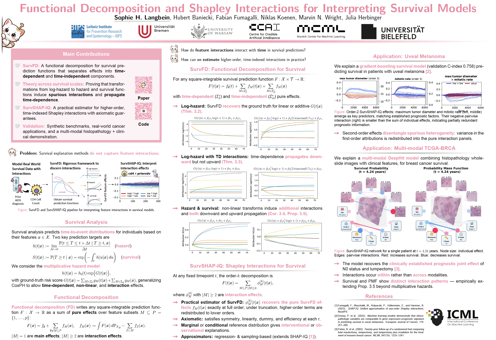

## SurvSHAP-IQ [ICML 2026]

This repository is a code supplement to the following [paper](https://openreview.net/forum?id=SldP4LGjdz):

> S. H. Langbein, H. Baniecki, F. Fumagalli, N. Koenen, M. N. Wright, J. Herbinger. **Functional Decomposition and Shapley Interactions for Interpreting Survival Models**. *ICML 2026*

**TL;DR:** We introduce a principled framework based on functional decomposition and Shapley values to explain time-dependent feature interactions in machine learning survival models.

[](assets/poster.pdf)

### Section 4.1: Experiments with simulated data

Create environment with the modified shapiq package (based on version 1.3.1).

```
conda env create -f env.yml
```

Simulate data with `simulation_experiments/simulate_simsurv_final.r` and `simulation_experiments/simulate_simsurv_corr.r` (data in `simulation_experiments/data`).

Run experiments on randomly selected observation and plot results with `simulation_experiments/sim_survshapiq.py`, `simulation_experiments/sim_survshapiq_corr.py` and `simulation_experiments/sim_survshapiq_marg_cond.py`.

Obtain full explanations for simualted datasets with `simulation_experiments/sim_survshapiq_global.py` (results in `simulation_experiments/experiments`) and compute local accuracy results with `simulation_experiments/local_accuracy.py`.


### Section 4.2: Experiments with real world data

Create environment with the modified shapiq package (based on version 1.3.1).

```
conda env create -f env.yml
```

Explain the models with `experiments/explain_actg.ipynb` and `experiments/explain_uvealmelanoma.ipynb`.

Run approximator benchmark with `sbatch experiments/run_approximators_benchmark.sh` (see `experiments/run_approximators_benchmark.py`).

Plot the benchmark results with `experiments/plot_approximators_benchmark.ipynb`.

### Section 4.2: Multi-modal TCGA-BRCA

See the `experiments_tcga-brca` directory for code and instructions to reproduce 
the experiments on the TCGA-BRCA dataset.
